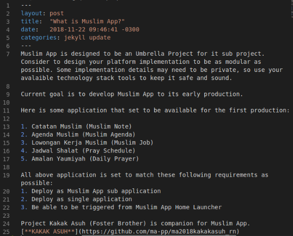

# MA-PP

How to add Post 
1. enter to '_posts' directory
2. make file with markdown exstension. example : mystory.md

you can see image bellow

How to add Page
1. enter to this repo/folder (make sure you are in root directory)
2. add file with markdown exstension. example : test.md
3. just like step above

How to edit Page
1. enter to this repo/folder (make sure you are in root directory)
2. just edit which the file you wanna edit in markdown format

this page was forked from [**here**](https://github.com/willianjusten/minimal-blog)