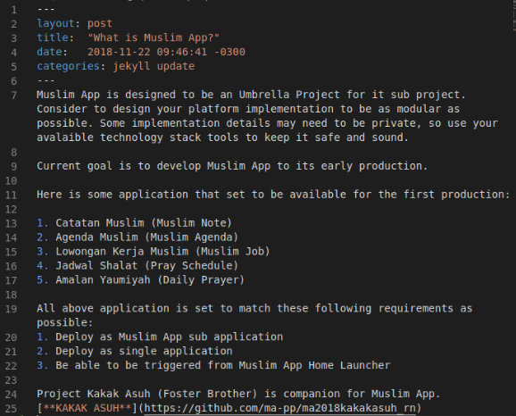

# MA-PP
> a minimal blog from Mobile App of Awesome Muslim Life

## How to add some Post 
1. enter to '_posts' directory
2. make file with markdown exstension. example : mystory.md

the format post like shown bellow

## How to add Page
1. enter to this repo/folder (make sure you are in root directory)
2. add file with markdown exstension. example : test.md
3. just like step [Above](#How to add some Post)

## How to edit Page
1. enter to this repo/folder (make sure you are in root directory)
2. just edit which the file you wanna edit in markdown format

this page was generated from [**here**](https://github.com/willianjusten/minimal-blog)